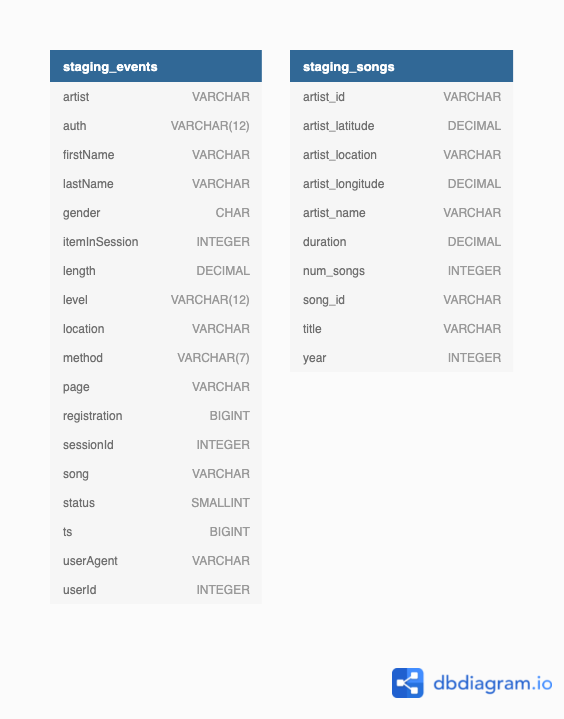
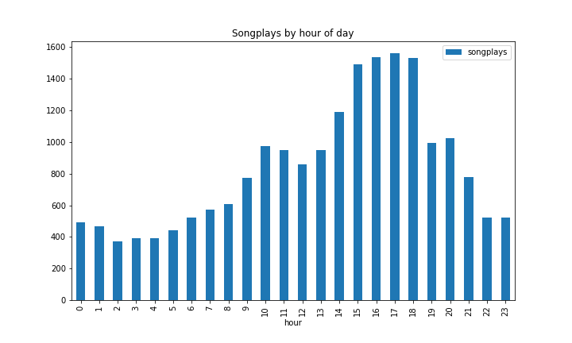
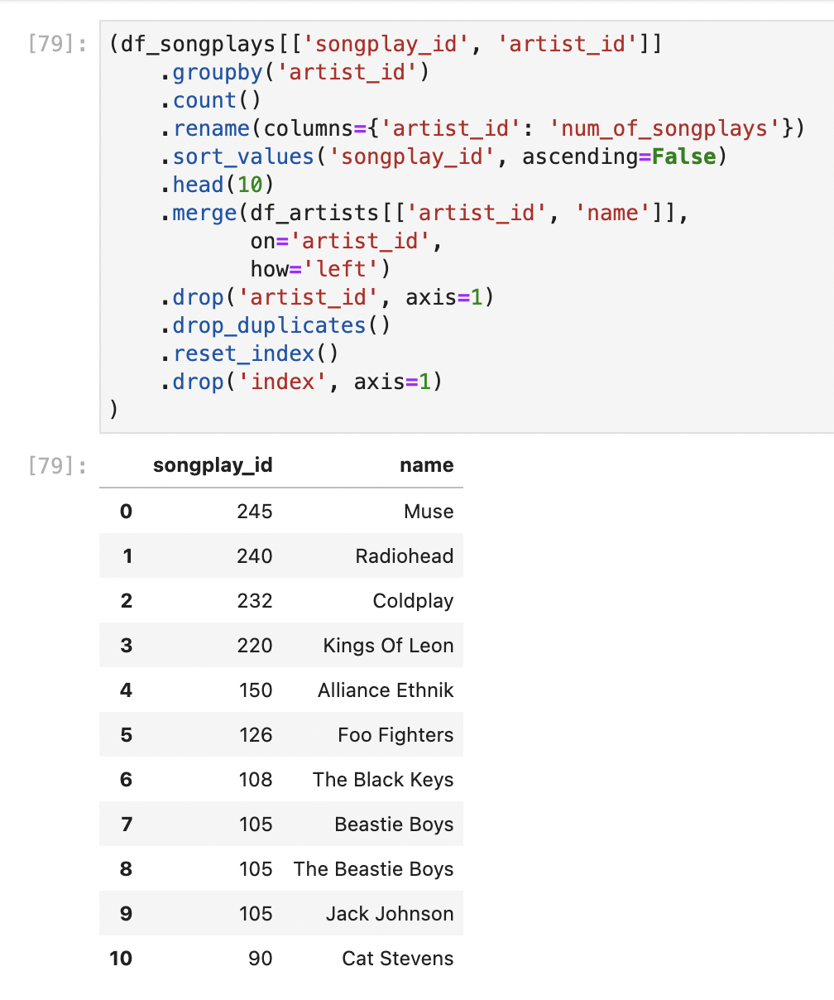
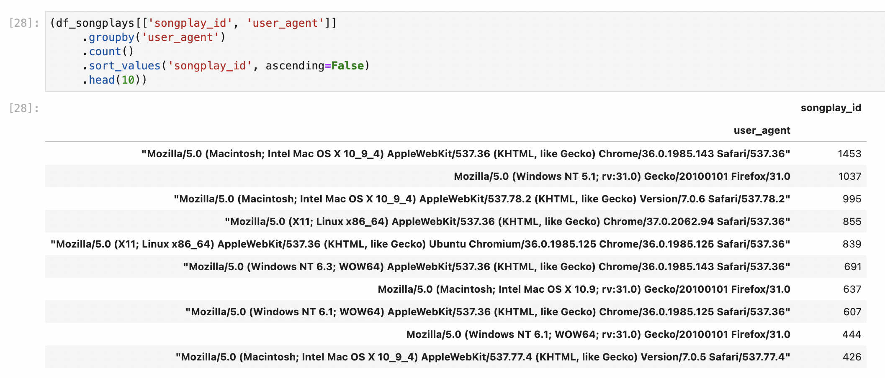
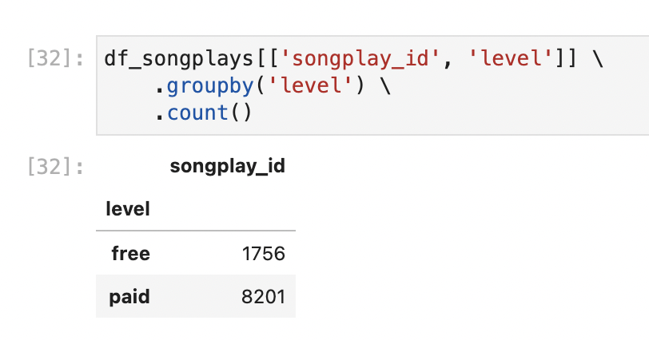

# AWS Cloud Data Warehouse with Redshift

### Table of Contents
- Introduction to this project
- Database schema design and ETL process
- Data analysis
- Files in this repository
- How to run the python scripts

### Introduction: Sparkify Audio Streaming, User Data and AWS.

Sparkify is a (fictional) startup that offers music streaming services. They accumulate 
data but do not yet leverage them. In this project I build an
ETL pipeline that loads data from S3 to Redshift. A walk through a concept in [a jupyter notebook.](./notebooks/Sample_Loads.ipynb) 

In order to perform the ETL process, I connect to the S3 bucket using Python and boto3. I then copy all json files that are stored in that bucket to AWS Redshift.
The data first lands to a staging table. From there the ETL processes transform the data by using SQL to SQL design in Redshift. 

With the data model and the Sparkify will have the ability to perform several analyses.
For instance, Sparkify will gain the ability to understand which songs are being played
the most, which OS and browser their users use or how the distribution between free
and paid users is.

Now that we have learned more about Sparkify and the purpose of this project, 
I will present more details about the data in the next chapter.

### Database Schema Design and ETL Process

The data is stored as json files in AWS S3. The buckets are:

- Song data: `s3://udacity-dend/song_data`
- Log data: `s3://udacity-dend/log_data`

The first ETL step is to copy all these files into Redshift. Here is the data model for the two staging tables:

The next steps of the ETL is to distribute these columns into their respective dimensions tables. 

__events data:__
- users
- time

__song data:__
- artists
- songs

In the center of the dimension table will be the facts table. together, these form
a star schema.

#### The Facts Table "Songplays" and the Star Schema

The `songplays` table is in the center of the four dimension tables. It gets its
data from the original `log_data` as well as the `user_id` from the `users` and the 
`artist_id` from the `artists` table. The `songplays` table references every dimension 
table with a corresponding foreign key. The following diagram shows the relation
of every column of the facts table:

#### Rationale and Data Analysis

With the facts table, sparkify has now many uses for business analysis. Here are some questions that can
be answered now:

- At what hours of the day are the most songplays?
- What artists are being played the most?
- What browser / operating system are being used?
- What is the distribution between free and paid users?

Let's look at the analysis of these questions.

_Most listeners are active around afternoon to evening._

_The top three most played artists are: 1 Muse, 2 Radiohead, 3 Coldplay._

_Apparently most users listen on MacOS._

_There are way more paid users listening on Sparkify then free users._

### Files in this repository

There are four folders in this repository.

- __notebooks__ holds all jupyter notebook. These are files ending in `ipynb`.
- __src__ holds the python package "aws_client" and the scripts that perform the ETL process. 
- __documentation__ contains pictures, screenshots, diagrams, etc.

Inside __notebooks__ you will find three files. Here is a brief explanation of 
the notebooks:

- `Sample_Loads.ipynb` walks through the ETL process and explains the steps. 
- `explore_s3.ipynb` explores the original source data on S3.
- `songplays_analysis.ipynb` analyses the sparkify data.

Inside __src__ you will find five files upon which this project depends. Run these files in this order. Here is
a short introduction to these scripts:

- `create_infrastructure.py` Creates a redshift cluster.
- `create_tables.py` Creates all tables described above on the redshift cluster.
- `etl.py` Loads data to redshift and performs sql to sql etl.  
- `destroy_infrastructure.py` Destroys the redshift cluster.
- `sql_queries.py` Holds all sql queries that are used on AWS Redshift. 

### How to run the python scripts

Before you run the scripts, you need to add two environment variables. Please make sure to define these two env vars:

- __CREDS__AWS_UDACITY__KEY__ -> AWS key
- __CREDS__AWS_UDACITY__SECRET__ -> AWS secret

Python gets the secrets from your environment and uses those inside the script.

Additionally, make sure to update [dwh.cfg](config/dwh.cfg).

As mentionned above, there is a logical order of the scripts to run. Please run the scripts in this order:

1. create_infrastructure.py
2. create_tables.py
3. etl.py
4. delete_infrastructure.py